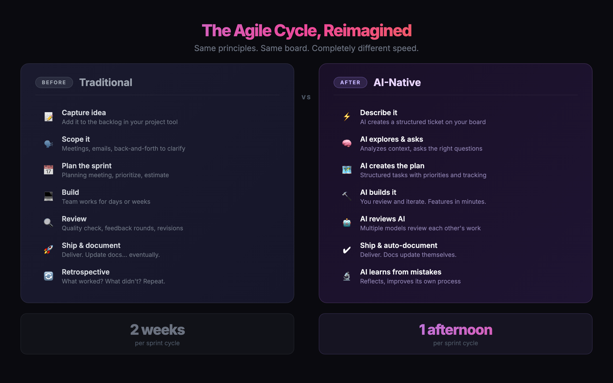

# AI-Native Agile: Prompt Toolkit

Prompts for the xMba "Agile Work & Vibe Coding" workshop.

## The Workflow

| # | Prompt | When | Tool |
|---|--------|------|------|
| 01 | [Whiteboard to Linear](01-whiteboard-to-linear.md) | Morning — after whiteboard session | Claude + Linear MCP |
| 02 | [Refine Backlog](02-refine-backlog.md) | Morning — after tickets are created | Claude + Linear MCP |
| 03 | [Sprint Build Workflow](03-sprint-build.md) | Afternoon — during build sprint | Replit + Linear MCP |
| 04 | [Review & Improve](04-review-and-improve.md) | Afternoon — after building features | Any AI tool |

## Setup

**Morning (Claude + Linear):**
1. Create a Linear workspace at [linear.app](https://linear.app) (free)
2. Open [claude.ai](https://claude.ai) > Settings > Integrations > Connect Linear
3. Test: ask Claude "Show my Linear backlog"

**Afternoon (Replit + Linear):**
1. Open your Replit project
2. Click Integrations (puzzle piece icon) > Connect Linear
3. Test: ask Replit Agent "Show my Linear backlog"

## What is MCP?

MCP (Model Context Protocol) lets AI tools talk directly to other apps. Connect Linear to Claude, and Claude can create tickets, read your backlog, and update status — all through conversation. No copy-pasting between tools.

Today we make two connections:
- **Claude + Linear** (morning) — AI reads your whiteboard photo and creates tickets
- **Replit + Linear** (afternoon) — AI reads your tickets and builds the features

## Inspiration

This workflow is inspired by [Zevi Arnovitz's AI development process](https://www.youtube.com/watch?v=1em64iUFt3U) (PM @ Meta), where structured prompts guide AI through issue creation, planning, building, review, and documentation — enabling non-technical builders to ship production-quality products.

## Resources

- [Tom Blomfield / YC: Vibe Coding Best Practices](https://www.youtube.com/watch?v=BJjsfNO5JTo)
- [Zevi Arnovitz / Lenny's Podcast: Building Real Products Without Code](https://www.youtube.com/watch?v=1em64iUFt3U)
